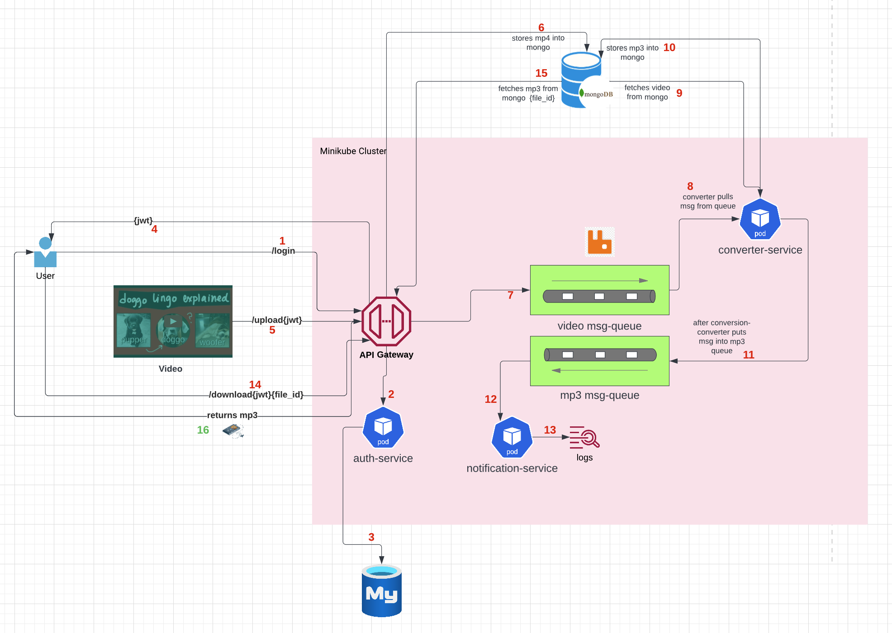
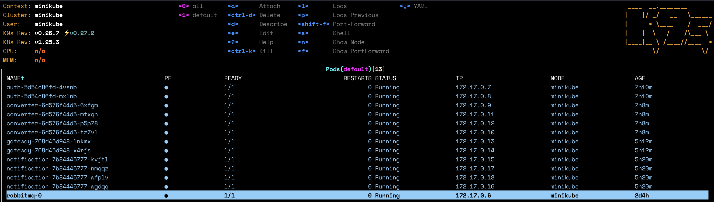

# MP4 → MP3 Converter

## Overview

- This project converts an uploaded video-file into a mp3 audio file.  
- This project is based on a Microservice architecture comprised of four services - `auth`,`gateway`,`converter` and `notification`.
- The API gateway and auth services are Flask servers, and the converter and notification services are RabbitMQ consumers. All services run in kubernetes pods within our local `minikube` cluster.
- The services communicate between each other with RESTful API calls.
- Before a user can use this application, they must login, and if validated, they will receive a `jwt token`- which they must supply in all subsequent API calls. The admin users are stored locally on a `mysql` database.
- The uploaded video file and the converted audio file are stored as `binary-json (bson)` objects in our local `MongoDB`.
- This project provides asynchronous inter-service communication between the `gateway` and `converter` services via a RabbitMQ message-queue. 

## Architecture and Control Flow

### Control Flow :

1. User hits `/login` end-point with username & password.
2. Credentials are sent to the `auth` service.
3. `auth` service validates that the credentials are legitimate.
4. `jwt` token is sent to the user.
5. User hits the `/upload` endpoint with the provided jwt as a bearer token.
6. The `gateway` service uploads the video to MongoDB.
7. Once the upload is complete, the `gateway` service puts a message (with file-id) into the video-queue.
8. The `converter` consumer pulls the message from the video queue.
9. Using the file-id, the `converter` pulls the video from MongoDB.
10. The `converter` converts the video into a MP3 and uploads it back to MongoDB.
11. The `converter` puts a message with the converted mp3 file id into the mp3 message-queue.
12. The `notification` consumer reads these messages.
13. The `notification` consumer logs the file-id so user can access it.
14. User uses the file-id and jwt to hit the `/download` end-point.
15. The `gateway` takes the file-id, and pulls the mp3 from MongoDB.
16. The mp3 is returned to the user and is downloaded locally.

## Project Dependencies
- Python 3.9+
- Docker : `brew install docker`
- Kubernetes CMD tools (kubectl) : `brew install kubectl`
- Minikube : `brew install minikube`
- Make sure the docker daemon is up, then `minikube start --driver = docker`
- K9S : `brew install k9s`
- MySQL
  - Make sure you install mysql running the same architecture of your system python, or else, some packages we use to interface with mysql will not operate correctly.
  - For instance, if you python is built for `x86` (check with `import platform`,`platform.machine()`), then first make sure your `homebrew` is `x86` homebrew and not `arm64` homebrew. 
  - `which brew` will either return `/opt/homebrew/bin/brew` (Apple Silicon/ARM64) or `/usr/local/bin/brew` (Intel x86).
  - For Arm64 Macs, you will have to specifically install x86 homebrew, add an alias in `.zshrc` as `brew86` and then `brew86 install mysql`
  - Start mysql: `brew86 services start mysql` / `brew86 services restart mysql`
  - Use the `init.sql` script to set-up mysql: `mysql -u root < init.sql`
- Create a dockerhub account, and login via CLI: `docker login -u user_name -p password docker.io`
- Make sure you have `curl` / Postman etc installed to make API calls.

## Service Descriptions

### Auth Service

- `/login` endpoint: Checks for valid login credentials, and if so, returns a JWT.
- `/validate` endpoint: Ensures the received JWT is valid.
- Our JWTs are signed with a symmetric signing algorithm - `HS256` which has a single private key which only the auth service knows.
- The mysql environment variables are stored in `manifests/configmap.yaml` and the database password and jwt secret are stored in `manifests/secret.yaml`
- We have 2 replicas of this service running.

## Build and Deploy a Service

- Navigate to a service directory, for example: `/python/src/auth`
- `docker build .` to build the image. Store the SHA returned at the end of the build.
- `docker tag {SHA_value} {dockerhub_username}/auth:{tag}`
- `docker push {dockerhub_username}/auth:{tag}`
- `cd` into `manifests` and `kubectl apply -f ./`
- Go into `k9s` and verify that the service is up and logs are available.
- If we want to scale-up/down replicas : `kubectl scale deployment --replicas={new_replica_number} {service_name}` 

## General Notes

- We normally have Flask servers listen on specific IP address and port, but since the containers IPs constantly change when services go down/up, we have the server listen on `0.0.0.0` - on all IPs.
- `host.minikube.internal` in `manifests/configmap.yaml` indicates to kubernetes to interface with `localhost`

## Areas of Improvement

- Use a ORM like `sqlalchemy` instead of string SQL queries.
- Use github secrets to store passwords/secrets etc rather than check it in plain-text.  
