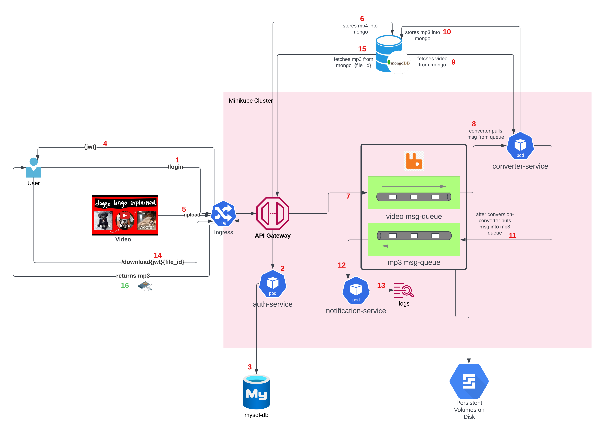

# MP4 -> MP3 Converter

## Overview

- This project converts an uploaded video-file into a mp3 audio file.  
- This project is based on a Microservice architecture comprised of four services - `auth`,`gateway`,`converter` and `notification`.
- The API gateway and auth services are Flask servers, and the converter and notification services are RabbitMQ consumers. All services run in kubernetes pods within our local `minikube` cluster.
- The services communicate between each other with RESTful API calls.
- Before a user can use this application, they must login, and if validated, they will receive a `jwt token`- which they must supply in all subsequent API calls. The admin users are stored locally on a `mysql` database.
- The uploaded video file and the converted audio file are stored as `binary-json (bson)` objects in our local `MongoDB`.
- This project provides asynchronous inter-service communication between the `gateway` and `converter` services via a RabbitMQ message-queue. 

## Architecture and Control Flow

### Control Flow :

1. User hits `/login` end-point with username & password.
2. Credentials are sent to the `auth` service.
3. `auth` service validates that the credentials are legitimate.
4. `jwt` token is sent to the user.
5. User hits the `/upload` endpoint with the provided jwt as a bearer token.
6. The `gateway` service uploads the video to MongoDB.
7. Once the upload is complete, the `gateway` service puts a message (with file-id) into the video-queue.
8. The `converter` consumer pulls the message from the video queue.
9. Using the file-id, the `converter` pulls the video from MongoDB.
10. The `converter` converts the video into a MP3 and uploads it back to MongoDB.
11. The `converter` puts a message with the converted mp3 file id into the mp3 message-queue.
12. The `notification` consumer reads these messages.
13. The `notification` consumer logs the file-id so user can access it.
14. User uses the file-id and jwt to hit the `/download` end-point.
15. The `gateway` takes the file-id, and pulls the mp3 from MongoDB.
16. The mp3 is returned to the user and is downloaded locally.
